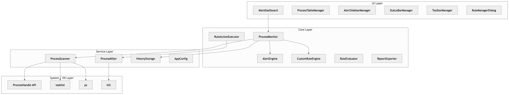
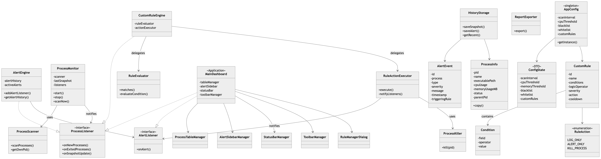
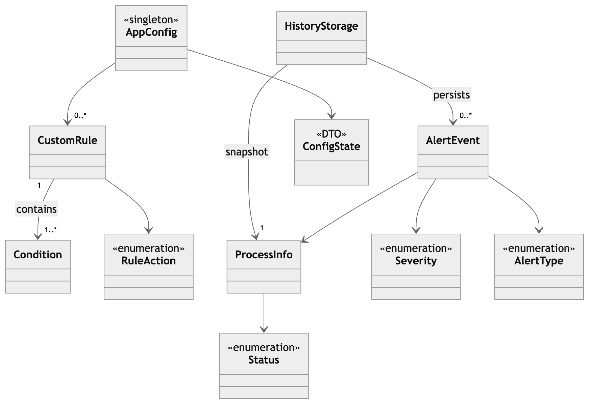
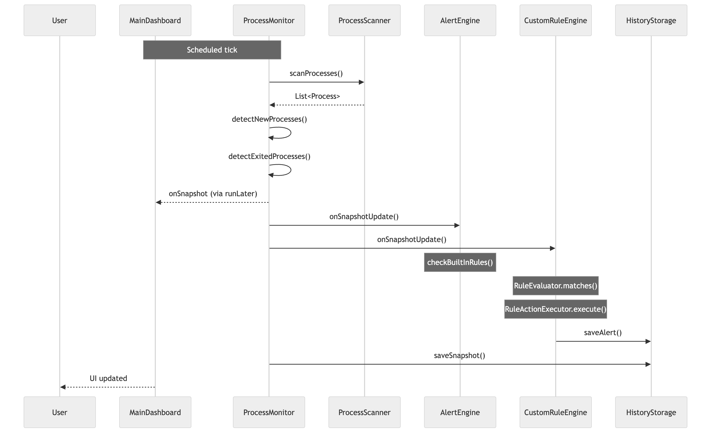
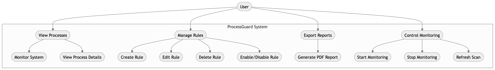
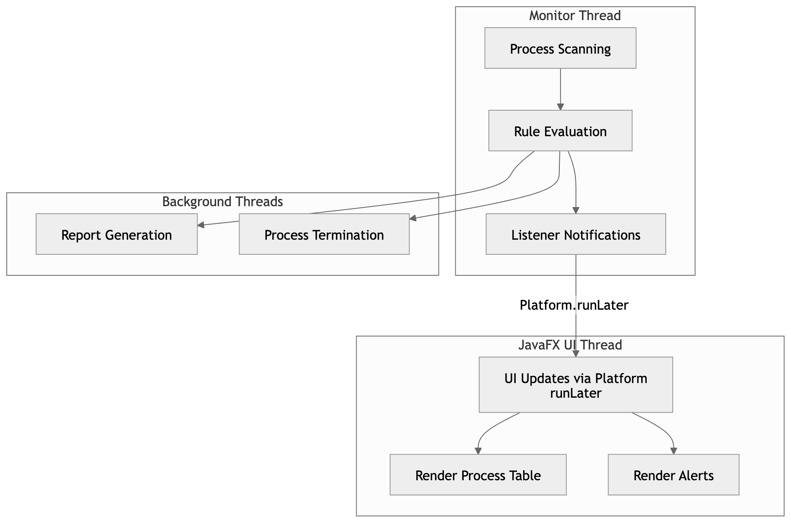
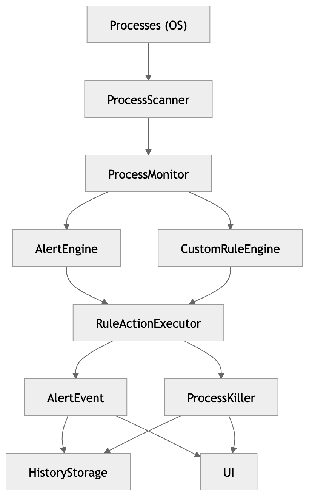

# SOFTWARE DESIGN DOCUMENT (SDD)

---

1. SYSTEM OVERVIEW
   ============================================================

ProcessGuard is a real-time process monitoring system that continuously scans system processes, evaluates them against both built-in and user-defined rules, and triggers alerts or automated actions.

Core capabilities:
- Real-time process tracking
- Rule-based anomaly detection
- Automated responses (alert / kill)
- Persistent history storage
- Interactive UI dashboard

HIGH-LEVEL FLOW
------------------------------------------------------------

ProcessScanner --> ProcessMonitor --> Rule Engines --> Alert System --> UI

-----

2. ARCHITECTURE DESIGN
   ============================================================

LAYERED ARCHITECTURE:

-----

3. FULL CLASS DIAGRAM
   ============================================================

------------------------------------------------------------
MODEL RELATIONSHIPS
------------------------------------------------------------

-----

4. SEQUENCE DIAGRAM
   ============================================================

-----

5.USE CASE DIAGRAM
   ============================================================

SYSTEM ACTIONS:
- Auto detect suspicious processes
- Auto generate alerts
- Auto kill malicious processes

-----

6.KEY DESIGN DECISIONS
   ============================================================

### Layered Architecture for Separation of Concerns
We adopted a layered architecture to separate system responsibilities into distinct components (UI, core logic, and data handling).  
This improves maintainability, testability, and allows independent development of modules.

### Observer Pattern for Decoupled Communication
The Observer pattern is used to decouple the monitoring engine from UI and alert systems.  
This allows multiple listeners (UI, logger, storage) to react to events without tight coupling.

### Singleton Pattern for Global Configuration
A Singleton is used for configuration management to ensure a single consistent source of truth across the application.

### Strategy Pattern for Rule Execution
The Strategy pattern enables dynamic rule evaluation logic, allowing new detection rules to be added without modifying core monitoring code.

### Delegation Pattern for UI Modularity
UI responsibilities are delegated to specialised components to keep the main controller lightweight and improve separation of UI concerns.

### JSON Storage for Simplicity and Portability
JSON is used for persistence due to its simplicity, readability, and ease of integration without requiring external database setup.

### ScheduledExecutorService for Controlled Concurrency
We use ScheduledExecutorService to manage background tasks in a controlled and thread-safe manner, preventing uncontrolled thread creation.

### Event-Driven Communication Model
The system follows an event-driven approach where components react to process events asynchronously, improving responsiveness and modularity.

-----

7.THREADING MODEL
   ============================================================

-----

8.DATA FLOW SUMMARY
   ============================================================
